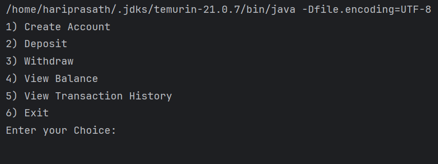
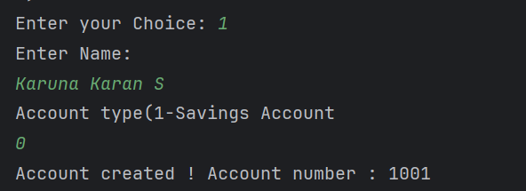
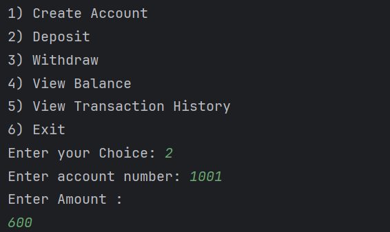

# 🏦 Java Bank Account Simulator

---

## ✨ Features

- 👤 Multi-user account management
- 💰 Deposit and withdrawal functionality
- 📜 Transaction history tracking
- 🧾 Balance inquiries
- 🪄 Inheritance: SavingsAccount with interest on deposit
- 🔁 Runs continuously until exit
- 💾 Fully CLI-based using Scanner

---

## 📸 Demo

### 🧭 Main Menu
  
*Users can create accounts, deposit/withdraw, and view balances or transactions.*

---

### ➕ Create New Account
  
*Supports SavingsAccount by default with auto-generated account numbers.*

---

### 💵 Deposit Funds
  
*Deposits money to a selected account, with interest applied for savings.*

---

### 🧾 Withdraw Funds
  
*Checks for sufficient balance before processing withdrawal.*

---

### 📋 View Transaction History
  
*Prints a log of all transactions done by the account.*

---

## 📁 Project Structure

```
bank-simulation/
├── Account.java
├── SavingsAccount.java
├── BankSystem.java
├── Main.java
├── images/
│   ├── menu.png
│   ├── create-account.png
│   ├── deposit.png
│   ├── withdraw.png
│   └── transactions.png
└── README.md
```

---

## 🚀 How to Run

### 1. Compile the project

```
bash
javac Main.java BankSystem.java Account.java SavingsAccount.java
```

### 2. Run the application
```
java Main
```

---

## 🛠 Tech Stack

- ☕️ Java SE — Core language for the application
- 📦 Object-Oriented Programming — Inheritance, encapsulation, overriding
- 💻 Terminal (CLI) — Interface for user interaction
- 🛠️ Git & GitHub — Version control and collaboration

---

## 🔮 Future Improvements

- 🔐 PIN-based user authentication
- 🏦 Add more account types (e.g., Current, FD)
- ⏱️ Timestamp each transaction
- 💽 Store user/account data in a file (persistence)
- 🖥️ GUI version using JavaFX for richer UI

---

## 🙋‍♂️ Author

Made with ❤️ by **[!HARI PRASATH K](https://github.com/hariPrasathK-Dev)**  
🚀 Java Developer Intern @ **Elevate Labs**

---

## ⭐ Show Your Support

If this project helped or inspired you:

- ⭐ Star the repository
- 🍴 Fork the repo and extend it your way
- 🔁 Share it with others

> ✍️ *"OOP isn't just a concept — it’s the backbone of how we build the real world in code."*

---